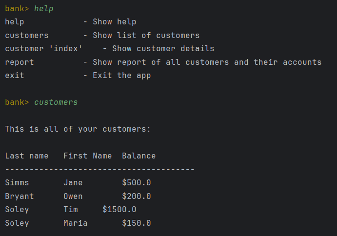
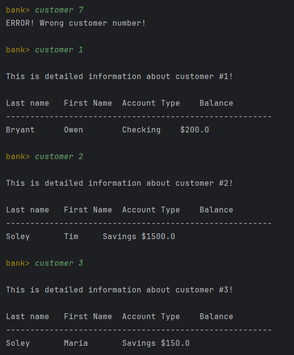
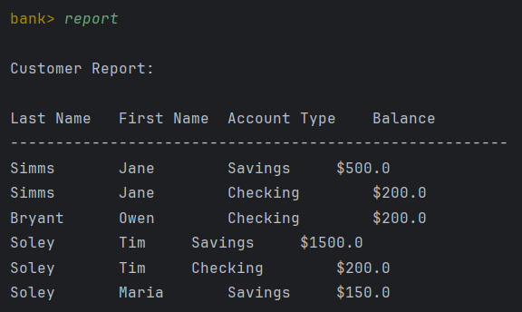

[](https://classroom.github.com/open-in-codespaces?assignment_repo_id=15212929)
# UI Lab 2 


## Скріни виконаної практичної 
#### 
#### 
#### 

## Код
```
package domain;

import com.mybank.domain.Bank;
import com.mybank.domain.CheckingAccount;
import com.mybank.domain.Customer;
import com.mybank.domain.SavingsAccount;
import java.io.BufferedReader;
import java.io.FileReader;
import java.io.IOException;
import java.io.PrintWriter;
import java.util.LinkedList;
import java.util.List;

import org.jline.reader.*;
import org.jline.reader.impl.completer.*;
import org.jline.utils.*;
import org.fusesource.jansi.*;

public class CLIdemo {

    public static final String ANSI_RESET = "\u001B[0m";
    public static final String ANSI_BLACK = "\u001B[30m";
    public static final String ANSI_RED = "\u001B[31m";
    public static final String ANSI_GREEN = "\u001B[32m";
    public static final String ANSI_YELLOW = "\u001B[33m";
    public static final String ANSI_BLUE = "\u001B[34m";
    public static final String ANSI_PURPLE = "\u001B[35m";
    public static final String ANSI_CYAN = "\u001B[36m";
    public static final String ANSI_WHITE = "\u001B[37m";

    private String[] commandsList;

    public void init() {
        commandsList = new String[]{"help", "customers", "customer", "report", "exit"};
    }

    public void run() {
        AnsiConsole.systemInstall(); // needed to support ansi on Windows cmd
        printWelcomeMessage();
        LineReaderBuilder readerBuilder = LineReaderBuilder.builder();
        List<Completer> completors = new LinkedList<Completer>();

        completors.add(new StringsCompleter(commandsList));
        readerBuilder.completer(new ArgumentCompleter(completors));

        LineReader reader = readerBuilder.build();

        String line;
        PrintWriter out = new PrintWriter(System.out);

        while ((line = readLine(reader, "")) != null) {
            if ("help".equals(line)) {
                printHelp();
            } else if ("customers".equals(line)) {
                printCustomers();
            } else if (line.startsWith("customer")) {
                printCustomerDetails(line);
            } else if ("report".equals(line)) {
                printReport();
            } else if ("exit".equals(line)) {
                System.out.println("Exiting application");
                return;
            } else {
                System.out.println(ANSI_RED + "Invalid command, For assistance press TAB or type \"help\" then hit ENTER." + ANSI_RESET);
            }
        }

        AnsiConsole.systemUninstall();
    }

    private void printCustomers() {
        AttributedStringBuilder a = new AttributedStringBuilder()
                .append("\nThis is all of your ")
                .append("customers", AttributedStyle.BOLD.foreground(AttributedStyle.RED))
                .append(":");

        System.out.println(a.toAnsi());
        if (Bank.getNumberOfCustomers() > 0) {
            System.out.println("\nLast name\tFirst Name\tBalance");
            System.out.println("---------------------------------------");
            for (int i = 0; i < Bank.getNumberOfCustomers(); i++) {
                System.out.println(Bank.getCustomer(i).getLastName() + "\t\t" + Bank.getCustomer(i).getFirstName() + "\t\t$" + Bank.getCustomer(i).getAccount(0).getBalance());
            }
        } else {
            System.out.println(ANSI_RED + "Your bank has no customers!" + ANSI_RESET);
        }
    }

    private void printCustomerDetails(String line) {
        try {
            int custNo = 0;
            if (line.length() > 8) {
                String strNum = line.split(" ")[1];
                if (strNum != null) {
                    custNo = Integer.parseInt(strNum);
                }
            }
            if (custNo >= 0 && custNo < Bank.getNumberOfCustomers()) {
                Customer cust = Bank.getCustomer(custNo);
                String accType = cust.getAccount(0) instanceof CheckingAccount ? "Checking" : "Savings";

                AttributedStringBuilder a = new AttributedStringBuilder()
                        .append("\nThis is detailed information about customer #")
                        .append(Integer.toString(custNo), AttributedStyle.BOLD.foreground(AttributedStyle.RED))
                        .append("!");

                System.out.println(a.toAnsi());

                System.out.println("\nLast name\tFirst Name\tAccount Type\tBalance");
                System.out.println("-------------------------------------------------------");
                System.out.println(cust.getLastName() + "\t\t" + cust.getFirstName() + "\t\t" + accType + "\t$" + cust.getAccount(0).getBalance());
            } else {
                System.out.println(ANSI_RED + "ERROR! Wrong customer number!" + ANSI_RESET);
            }
        } catch (Exception e) {
            System.out.println(ANSI_RED + "ERROR! Wrong customer number!" + ANSI_RESET);
        }
    }

    private void printReport() {
        AttributedStringBuilder a = new AttributedStringBuilder()
                .append("\nCustomer Report", AttributedStyle.BOLD.foreground(AttributedStyle.RED))
                .append(":");

        System.out.println(a.toAnsi());
        if (Bank.getNumberOfCustomers() > 0) {
            System.out.println("\nLast Name\tFirst Name\tAccount Type\tBalance");
            System.out.println("-------------------------------------------------------");
            for (int i = 0; i < Bank.getNumberOfCustomers(); i++) {
                Customer customer = Bank.getCustomer(i);
                for (int j = 0; j < customer.getNumberOfAccounts(); j++) {
                    String accType = customer.getAccount(j) instanceof CheckingAccount ? "Checking" : "Savings";
                    System.out.println(customer.getLastName() + "\t\t" + customer.getFirstName() + "\t\t" + accType + "\t\t$" + customer.getAccount(j).getBalance());
                }
            }
        } else {
            System.out.println(ANSI_RED + "Your bank has no customers!" + ANSI_RESET);
        }
    }

    private void printWelcomeMessage() {
        System.out.println("\nWelcome to " + ANSI_GREEN + " MyBank Console Client App" + ANSI_RESET + "! \nFor assistance press TAB or type \"help\" then hit ENTER.");
    }

    private void printHelp() {
        System.out.println("help\t\t\t- Show help");
        System.out.println("customers\t\t- Show list of customers");
        System.out.println("customer 'index'\t- Show customer details");
        System.out.println("report\t\t\t- Show report of all customers and their accounts");
        System.out.println("exit\t\t\t- Exit the app");
    }

    private String readLine(LineReader reader, String promtMessage) {
        try {
            String line = reader.readLine(promtMessage + ANSI_YELLOW + "\nbank> " + ANSI_RESET);
            return line.trim();
        } catch (UserInterruptException e) {
            // e.g. ^C
            return null;
        } catch (EndOfFileException e) {
            // e.g. ^D
            return null;
        }
    }

    public static void loadCustomersFromFile(String filename) {
        try (BufferedReader br = new BufferedReader(new FileReader(filename))) {
            String line;
            int numCustomers = Integer.parseInt(br.readLine().trim()); // Read the number of customers
            while ((line = br.readLine()) != null) {
                String[] customerData = line.split("\t");
                if (customerData.length == 3) {
                    String firstName = customerData[0];
                    String lastName = customerData[1];
                    int numAccounts = Integer.parseInt(customerData[2]);

                    Bank.addCustomer(firstName, lastName);
                    Customer customer = Bank.getCustomer(Bank.getNumberOfCustomers() - 1);

                    for (int i = 0; i < numAccounts; i++) {
                        line = br.readLine();
                        String[] accountData = line.split("\t");
                        String accountType = accountData[0];
                        double balance = Double.parseDouble(accountData[1]);
                        if ("S".equals(accountType)) {
                            double interestRate = Double.parseDouble(accountData[2]);
                            customer.addAccount(new SavingsAccount(balance, interestRate));
                        } else if ("C".equals(accountType)) {
                            double overdraftProtection = Double.parseDouble(accountData[2]);
                            customer.addAccount(new CheckingAccount(balance, overdraftProtection));
                        }
                    }
                }
            }
        } catch (IOException e) {
            System.out.println(ANSI_RED + "ERROR! Could not read from file: " + filename + ANSI_RESET);
        }
    }

    public static void main(String[] args) {
        loadCustomersFromFile("data/test.dat");

        CLIdemo shell = new CLIdemo();
        shell.init();
        shell.run();
    }
}

```
Це одна з робіт, які доповнюють основний цикл лабораторних робіт #1-8 (проект **Banking**, [Netbeans](https://netbeans.org/)) з ООП.  Основна мета цих додаткових вправ - познайомитись з різними видами інтерфейсів користувача та засобами їх створення. Згадувані 'базові' роботи розміщено в [окремому репозиторії](https://github.com/liketaurus/OOP-JAVA) (якщо будете робити завдання на "4" або "5" раджу переглянути [діаграму класів](https://github.com/liketaurus/OOP-JAVA/blob/master/MyBank.png), аби розуміти які методи є у класів).

В ході першої роботи вам пропонується виконати **наступне завдання** - [Робота 2: CLI з jline 3](https://github.com/ppc-ntu-khpi/TUI-Lab2-Starter/blob/master/Lab%202%20-%20CLI/Lab%202.md)
  
**Додаткове завдання** (для тих хто зробив все і прагне більшого): [дивіться тут](https://github.com/ppc-ntu-khpi/TUI-Lab2-Starter/blob/master/Lab%202%20-%20CLI/Lab%202%20-%20add.md)

Всі необхідні бібліотеки містяться у теці [jars](https://github.com/ppc-ntu-khpi/TUI-Lab2-Starter/tree/master/jars). В тому числі - всі необхідні відкомпільовані класи з робіт 1-8 - файл [MyBank.jar](https://github.com/ppc-ntu-khpi/TUI-Lab2-Starter/blob/master/jars/MyBank.jar). Файл даних лежить у теці [data](https://github.com/ppc-ntu-khpi/TUI-Lab2-Starter/tree/master/data).

---
**УВАГА! Не забуваємо здавати завдання через Google Classroom та вказувати посилання на створений для вас репозиторій!**

Також пам'ятайте, що ніхто не заважає вам редагувати файл README у вашому репозиторії😉.
А ще - дуже раджу спробувати нову фічу - інтеграцію з IDE REPL.it (хоч з таким завданням вона може й не впоратись, однак, цікаво ж!).


 
[](https://gitter.im/PPC-SE-2020/OOP?utm_source=badge&utm_medium=badge&utm_campaign=pr-badge)
